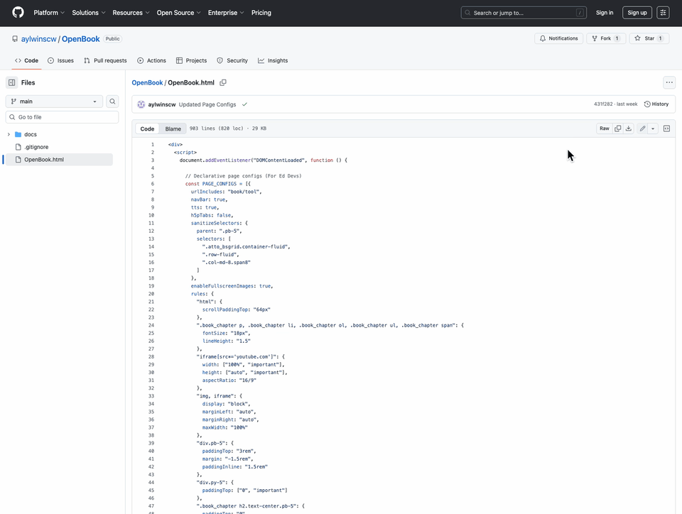

# Getting Started with OpenBook

How to use OpenBook in 3 steps

Step 1: Head to [here](https://github.com/aylwinscw/OpenBook/blob/main/OpenBook.html) and copy the script.

Step 2: Pick one Moodle book you would like to use. Click on **Setting** > **Select HTML </>** then paste the code. Remember to click **Save and Display** after you have pasted the code.

Step 3: Click **More** > **Print book** to view.

