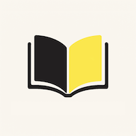

# OpenBook

> Turns your Moodle Book into a UDL-friendly webpage within seconds

- Built for Educators, Developers and Students

[Source code](https://github.com/aylwinscw/OpenBook)
[Getting Started](#getting-started-with-openbook)

